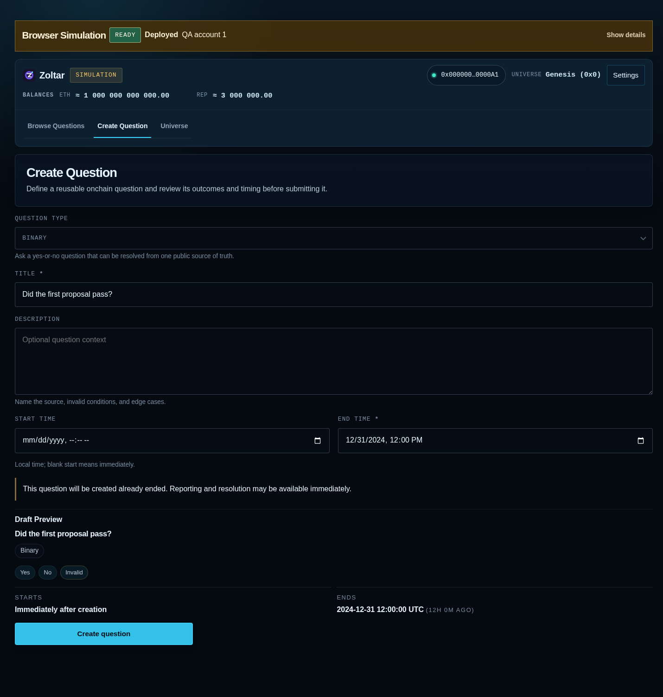
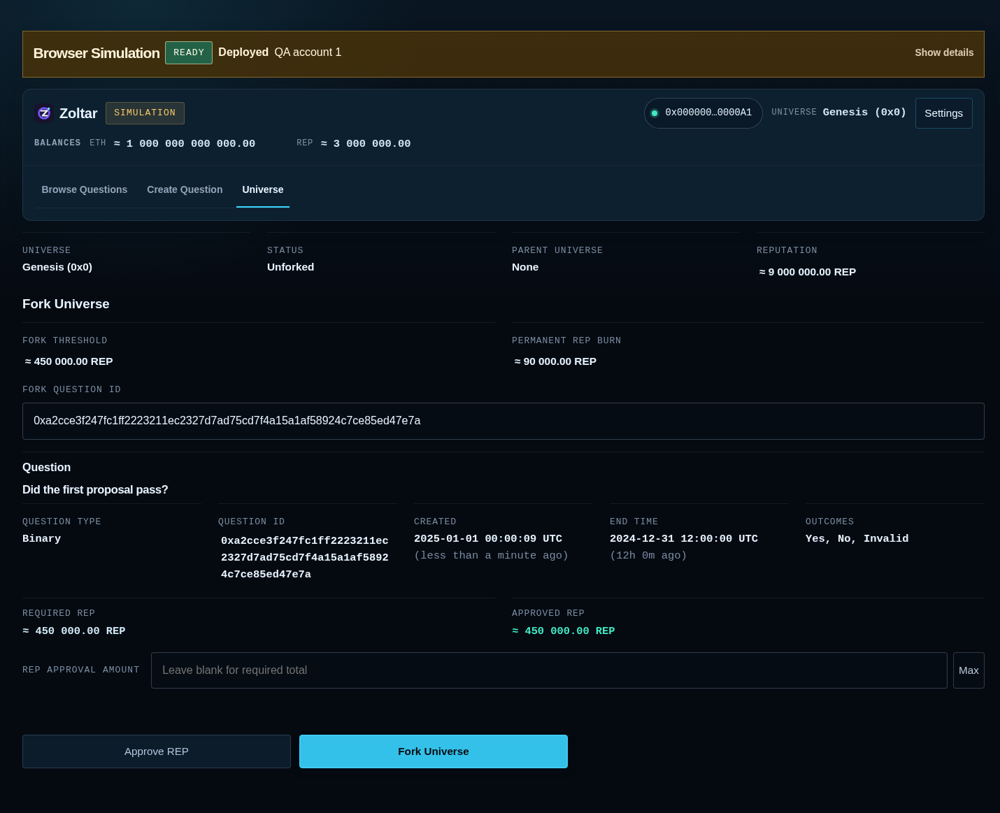
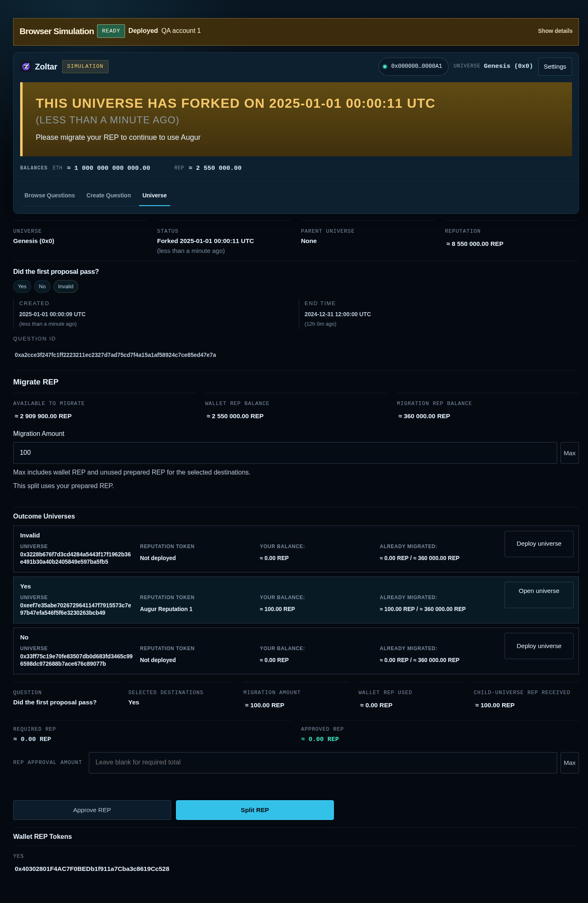

# AugurForkingLayer

AugurForkingLayer currently hosts **Zoltar**, a forkable oracle with Solidity contracts and a web interface for managing questions, universes, and reputation-token migration.

Zoltar is kept in its own [`zoltar/`](zoltar/) workspace. Its dependencies, contracts, UI, tests, and build tools run independently of any future AugurForkingLayer components.

## What Zoltar does

- Registers questions and their possible outcomes.
- Tracks oracle universes and reputation (REP) tokens.
- Supports forking a universe around a question and creating outcome-specific child universes.
- Provides UI workflows for contract deployment, question creation, forking, and REP migration.
- Includes a browser simulation for exploring these workflows without a wallet or public-chain transactions.

## UI screenshots

These screenshots show the production UI completing question creation, forking, and REP migration with simulated contracts.

### Create a question

Define the question, outcomes, and resolution time before submitting it.



### Fork a universe

Approve the required REP and fork the universe around the selected question.



### Migrate REP

Split REP into outcome-specific child universes and view the resulting token balances.



## Run locally

Install **Bun 1.4.2** and **Node.js 20+**, then run:

```sh
cd zoltar
bun run setup
bun run app:serve:zoltar
```

Open [the simulated Zoltar UI](http://localhost:4153/?simulate=1&simScenario=deployed#/zoltar). For automatic rebuilds during development, use `bun run app:watch:zoltar` instead of the serve command.

See the [Zoltar README](zoltar/readme.md) for wallet connections, local-chain settings, production builds, and deployment commands.

## Repository layout

| Path | Purpose |
| --- | --- |
| `zoltar/solidity/` | Contracts, compiler, and contract tests |
| `zoltar/shared/` | Shared runtime and Zoltar protocol libraries |
| `zoltar/ui/` | Zoltar application, shared UI components, and browser simulation |
| `zoltar/tooling/` | Build, validation, browser, and deployment tools |
| `zoltar/docs/` | Protocol and operator notes |
| `.github/` | CI with browser checks, release builds, and manual testnet deployment |

## Validate

From `zoltar/`:

```sh
bun run build:prod
bun run compile-contracts
bun run check
bun run test
bun run check:artifacts
bun run test:browser
```

`check` runs TypeScript, formatting, lint, import-boundary checks, and Knip in normal and production modes. `test` runs the contract, UI/runtime, and tooling suites. Browser checks require Chromium; set `CHROMIUM_PATH` if it is not detected automatically.

CI runs these checks on pull requests, including browser smoke tests and the full question-to-REP-migration workflow.

## Integration

The production artifact check compares all 19 contract ABIs and creation/runtime bytecodes with the recorded [contract baseline](zoltar/import-manifest.json).

Future integrations should use [`IZoltar.sol`](zoltar/solidity/contracts/IZoltar.sol), generated ABIs, and runtime package exports. The UI application and private build tools remain internal to the Zoltar workspace.

See [protocol and operator notes](zoltar/docs/protocol.md) and the [Zoltar license](zoltar/LICENSE).

### Network addresses

Generated deterministic addresses are listed for [mainnet](zoltar/docs/mainnet-deployment-addresses.json) and [Sepolia](zoltar/docs/sepolia-deployment-addresses.json). Run `bun run addresses:update` from `zoltar/` after contract or configuration changes. CI checks that both files are current. These files do not confirm on-chain deployment.
